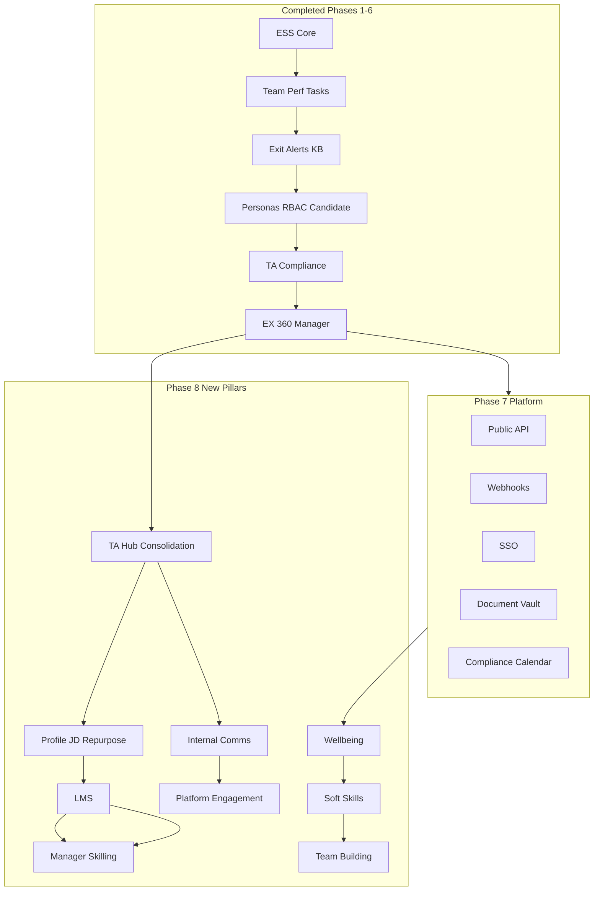
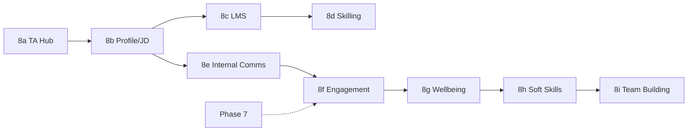

# HIREFLOW HRMS – Complete Build Plan in Sequence

This document is the single source of truth for the full build sequence, current status, and flow ahead.

---

## Executive Summary

| Phase | Status | Focus |
|-------|--------|-------|
| **1–3** | Done | HRMS core (ESS, Team, Leave, Attendance, Tasks, Performance, Exit) |
| **4** | Done | Personas, RBAC, Super Admin, Admin HR, Candidate data (CTC, skills) |
| **5** | Done | TA (JobReq, stages, source), Compliance exports, HR Data page |
| **6** | Done | Pulse, Recognition, Announcements, Employee 360, Manager dashboard |
| **7** | Pending | Platform (Public API, Webhooks, SSO, Document Vault, Compliance Calendar) |
| **8** | Pending | TA Hub consolidation, Profile/JD repurposing, LMS, Wellbeing, Skilling, Internal Comms, Platform engagement |

---

## End-to-End Flow

---

## Part 1: Completed Phases (Reference)

### Phase 1–3: HRMS Core (Done)

- Overview, Attendance, Leave, Team, People
- Tasks, Performance, Exit, Alerts, Calendar, Knowledge Base
- RBAC for manager/admin

### Phase 4: Personas & Candidate Data (Done)

- Roles: employee, admin_hr, admin (Super Admin)
- Super Admin: full user edit; Admin HR: edit except role/isActive
- Employee: ESS-only nav (hide Recruitment)
- Candidate: CTC, presentCompany, experienceYears, noticePeriodDays, technologies

### Phase 5: TA & Compliance (Done)

- JobRequisition, Candidate.source, Candidate.stage
- TA Dashboard API, candidate filters (stage, source)
- Report routes: CSV exports (employees, candidates, attendance, leave)
- HR Data page with export tiles

### Phase 6: EX & Single Place (Done)

- PulseCheck, Recognition, Announcement
- Smart leave suggestions in Overview
- Employee 360 (`/people/:id`), Manager dashboard (`/manager-dashboard`)
- Give thanks on Employee 360; recent recognitions on Overview

---

## Part 2: Phase 7 – Platform (Pending)

**Dependencies:** Phase 6 complete.

### 7.1 Public API

| Step | Task | Details |
|------|------|---------|
| 7.1.1 | Schema | `ApiKey` model: id, hashedKey, scope (read/write), createdById, createdAt |
| 7.1.2 | Migration | Add ApiKey table |
| 7.1.3 | Middleware | `apiKeyAuth.ts` – validate `X-API-Key` for `/api/v1/*` |
| 7.1.4 | Routes | `api/v1/employees`, `api/v1/leave/balances`, `api/v1/leave/requests`, `api/v1/leave/apply` |
| 7.1.5 | Admin UI | API key generation, list, revoke in Admin panel |

### 7.2 Webhooks

| Step | Task | Details |
|------|------|---------|
| 7.2.1 | Schema | `Webhook` (url, events[], secret, isActive, createdById) |
| 7.2.2 | Service | `webhookService.ts` – POST to URL on event with signature; retry logic |
| 7.2.3 | Triggers | candidate.stage_change, leave.approved, leave.rejected |
| 7.2.4 | Admin UI | Webhook CRUD (Super Admin only) |

### 7.3 SSO (Optional)

| Step | Task | Details |
|------|------|---------|
| 7.3.1 | Config | Admin: SSO provider URL, client ID, secret |
| 7.3.2 | Flow | Login → redirect IdP → callback → create/find user → JWT |

### 7.4 Document Vault

| Step | Task | Details |
|------|------|---------|
| 7.4.1 | Schema | `Document` (userId, type, filename, storageKey, version, createdAt) |
| 7.4.2 | Storage | Supabase Storage or S3 integration |
| 7.4.3 | API | Upload, list, download; types: offer_letter, policy |
| 7.4.4 | UI | Employee 360: Documents tab; Admin: upload |

### 7.5 Compliance Calendar

| Step | Task | Details |
|------|------|---------|
| 7.5.1 | Schema | `ComplianceItem` (title, dueDate, type, userId?, status) |
| 7.5.2 | API | CRUD for Admin HR; GET /compliance/due for user |
| 7.5.3 | UI | HR Data page: Compliance Calendar section |

---

## Part 3: Phase 8 – New Pillars (Detailed Sequence)

### Phase 8a: TA Hub Consolidation (First)

**Dependencies:** None (builds on existing).

| Step | Task | Details |
|------|------|---------|
| 8a.1 | Merge APIs | Single `GET /api/ta/hub` – combine dashboard stats + TA dashboard data |
| 8a.2 | New page | `TAHub.tsx` – one page with Overview tab (metrics, pipeline, source mix, pending feedback, offers) |
| 8a.3 | Quick actions | Add Candidate, Create Job Requisition, View Pending Feedback |
| 8a.4 | Recent activity | Feed: latest candidates, interviews, offers |
| 8a.5 | Layout | Remove "Recruitment" and "TA Dashboard"; add single "TA Hub" |
| 8a.6 | Cleanup | Deprecate/redirect Dashboard (Recruitment) and TADashboard routes |

**Deliverables:** One TA Hub page; single nav item.

---

### Phase 8b: Profile & JD Repurposing

**Dependencies:** 8a done.

| Step | Task | Details |
|------|------|---------|
| 8b.1 | Schema | Candidate: add `repurposedFromId?` (self-ref) |
| 8b.2 | API | POST /candidates/repurpose – from candidate ID + jobRequisitionId; clone or reassociate |
| 8b.3 | Talent pool | GET /candidates?status=rejected&pool=true; tag candidates for reuse |
| 8b.4 | JD library | `JobDescription` model (title, department, body, requirements); `JobRequisition.clonedFromId?` |
| 8b.5 | Clone req | "Create from existing" when creating requisition – pick past req, clone JD |
| 8b.6 | Similar JDs | Suggest similar JDs on new req creation (title/department match) |
| 8b.7 | UI | Candidate profile: "Use for another role"; Req create: "Create from existing", similar JD links |

**Deliverables:** Profile repurpose; JD library; clone from past req.

---

### Phase 8c: LMS (Courses, Completion, Certification)

**Dependencies:** None.

| Step | Task | Details |
|------|------|---------|
| 8c.1 | Schema | Course, CourseEnrollment, Certification |
| 8c.2 | Migration | Add tables |
| 8c.3 | API | courseRoutes, enrollmentRoutes – CRUD; completion tracking |
| 8c.4 | Certification | Issue on completion; expiry for compliance courses |
| 8c.5 | UI | "My Learning" page – enrolled courses, progress, certificates |
| 8c.6 | Admin | Course catalog, bulk assign |
| 8c.7 | Employee 360 | Learning summary section |
| 8c.8 | Layout | Add "My Learning" nav for employee |

**Deliverables:** Course catalog; enrollment; completion; certification; My Learning page.

---

### Phase 8d: Manager-Led Skilling

**Dependencies:** 8c (LMS).

| Step | Task | Details |
|------|------|---------|
| 8d.1 | Schema | SkillingTask (userId, assignedById, courseId?, dueDate, status) |
| 8d.2 | API | Assign skilling task; list team skilling; completion % |
| 8d.3 | Manager Dashboard | "Team skilling" section |
| 8d.4 | My Team | "Skilling" tab – assign tasks, view completion |
| 8d.5 | Employee | Skilling tasks in Tasks or "My Skilling" |
| 8d.6 | Overview | Optional "Learn something today" widget |

**Deliverables:** Skilling tasks; Manager skilling tab; team completion view.

---

### Phase 8e: Internal Communications & Requests

**Dependencies:** 8a (TA Hub).

| Step | Task | Details |
|------|------|---------|
| 8e.1 | Schema | HiringRequest (requestedById, role, department, justification, status); RequestComment |
| 8e.2 | API | Hiring request submit, approve/reject; comments on req/candidate |
| 8e.3 | Request dashboard | TA Hub: "Hiring requests" section – pending, approvals |
| 8e.4 | Manager | "Request to Hire" form – role, department, justification |
| 8e.5 | Comments | In-thread comments on Job Requisition, Candidate |
| 8e.6 | Bulk messaging | CandidateMessage (templateId, sentAt); TA sends templated emails (optional) |

**Deliverables:** Hiring request workflow; TA–manager comments; request dashboard.

---

### Phase 8f: Platform Engagement (Interactive)

**Dependencies:** None.

| Step | Task | Details |
|------|------|---------|
| 8f.1 | Onboarding checklist | New hire: checklist items (Complete profile, Read policies, 1:1); progress bar |
| 8f.2 | Action cards | Overview: contextual cards ("2 pending tasks", "Submit pulse") |
| 8f.3 | Guided tours | First-time: product tour (Overview, Leave, People); dismissible |
| 8f.4 | Reactions | On Recognition, Announcements: thumbs up, clap |
| 8f.5 | Activity feed | Personal feed: "X completed course", "Y gave thanks"; team feed optional |
| 8f.6 | Global search | One search box – people, candidates, policies, courses |
| 8f.7 | Notifications | In-app + email prefs; extend existing Notification model |

**Deliverables:** Onboarding checklist; action cards; guided tours; reactions; activity feed; search.

---

### Phase 8g: Wellbeing & Health

**Dependencies:** Pulse (Phase 6) exists.

| Step | Task | Details |
|------|------|---------|
| 8g.1 | Schema | WellbeingCheck (multi-dimension: mood, energy, workload); HealthProgram, HealthProgramParticipation; WellnessResource |
| 8g.2 | API | Wellbeing check-in; program opt-in; resources list |
| 8g.3 | Burnout signals | Combine pulse + leave patterns → anonymous team alert for manager |
| 8g.4 | UI | Overview: wellbeing check-in; "Wellness" page – programs, EAP links |
| 8g.5 | Manager | Anonymous team wellbeing trend; "Team may need support" |
| 8g.6 | Layout | Add "Wellness" nav for employee |

**Deliverables:** Wellbeing check-ins; wellness page; EAP resources; manager alerts.

---

### Phase 8h: Soft Skills (Reflection, Empathy, Critical Thinking)

**Dependencies:** None.

| Step | Task | Details |
|------|------|---------|
| 8h.1 | Schema | ReflectionEntry, ReflectionPrompt; SoftSkillModule, SoftSkillCompletion, SoftSkillFeedback |
| 8h.2 | API | Reflection CRUD (private); soft-skill module list, completion; 360 feedback submit |
| 8h.3 | UI | "Reflections" – private journal; "Soft skills" – modules, exercises |
| 8h.4 | Manager | Suggest modules; 360 feedback; coaching nudges (optional) |
| 8h.5 | Layout | Add "Reflections", "Soft skills" nav |

**Deliverables:** Reflection journal; empathy/critical-thinking modules; 360 feedback.

---

### Phase 8i: Team Building

**Dependencies:** 8d (Manager Skilling) logical fit.

| Step | Task | Details |
|------|------|---------|
| 8i.1 | Schema | TeamBuildingEvent (managerId, title, scheduledAt, type, attendeeIds[]) |
| 8i.2 | API | Create event; list for team; attendance |
| 8i.3 | Manager | Create lunch & learn, hackathon, sync events |
| 8i.4 | UI | Manager Dashboard: upcoming events; My Team: events tab |
| 8i.5 | Calendar | Optional: sync team-building events to calendar |

**Deliverables:** Team-building events; attendance; calendar integration.

---

## Part 4: Phase 6 Remaining (Optional)

| Item | Effort | Sequence |
|------|--------|----------|
| Manager leave/regularization approval UI | 0.5–1 day | Can run in parallel with 8a |
| Resume parse (AI prefill in CreateCandidate) | 0.5–1 day | After Phase 7 or 8 |
| Anomaly alerts (attendance, leave spike, long-open reqs) | 0.5 day | After Phase 7 |

---

## Implementation Order (Recommended Sequence)

| Order | Phase | Focus | Est. Effort |
|-------|-------|-------|-------------|
| 1 | 8a | TA Hub consolidation | 0.5–1 day |
| 2 | 8b | Profile & JD repurposing | 1–1.5 days |
| 3 | 7.1 | Public API + API keys | 1–2 days |
| 4 | 8c | LMS (basic) | 2–3 days |
| 5 | 8d | Manager skilling | 1–1.5 days |
| 6 | 8e | Internal comms (hiring requests, comments) | 1.5–2 days |
| 7 | 8f | Platform engagement | 1–2 days |
| 8 | 7.2 | Webhooks | 1 day |
| 9 | 8g | Wellbeing | 1–1.5 days |
| 10 | 8h | Soft skills | 1.5–2 days |
| 11 | 8i | Team building | 0.5–1 day |
| 12 | 7.3–7.5 | SSO, Document Vault, Compliance Calendar | 2–4 days (as prioritized) |

---

## Files to Create / Modify (Master List)

### Backend

- **Schema:** Course, CourseEnrollment, Certification; SkillingTask; WellbeingCheck, HealthProgram, WellnessResource; ReflectionEntry, SoftSkillModule; TeamBuildingEvent; HiringRequest, RequestComment; JobDescription; ApiKey, Webhook, Document, ComplianceItem
- **Routes:** courseRoutes, enrollmentRoutes, skillingRoutes, wellbeingRoutes, reflectionRoutes, softSkillRoutes, hiringRequestRoutes, jobDescriptionRoutes; merge dashboard + ta into taHubRoutes
- **Middleware:** apiKeyAuth
- **Services:** webhookService

### Frontend

- **Pages:** TAHub (replace Dashboard + TADashboard); MyLearning, TeamSkilling, Wellness, Reflections, SoftSkills
- **Components:** OnboardingChecklist, ActionCards, GuidedTour, ActivityFeed, GlobalSearch
- **Extend:** ManagerDashboard (skilling, team-building, approval actions); Employee360 (learning, documents, wellness); Overview (action cards, wellbeing)

### Layout

- Replace "Recruitment" and "TA Dashboard" with "TA Hub"
- Add: "My Learning", "Wellness" (employee); "Team Skilling" (manager); "Learning Admin" (Admin HR, optional)

---

## Summary

- **Phases 1–6:** Complete.
- **Phase 7:** Platform (API, webhooks, SSO, documents, compliance) – can run in parallel or after 8a–8f.
- **Phase 8:** Nine sub-phases (8a–8i) – TA Hub first, then Profile/JD repurposing, LMS, skilling, comms, engagement, wellbeing, soft skills, team building.
- **Total remaining:** ~15–25 days depending on scope and parallelization.
