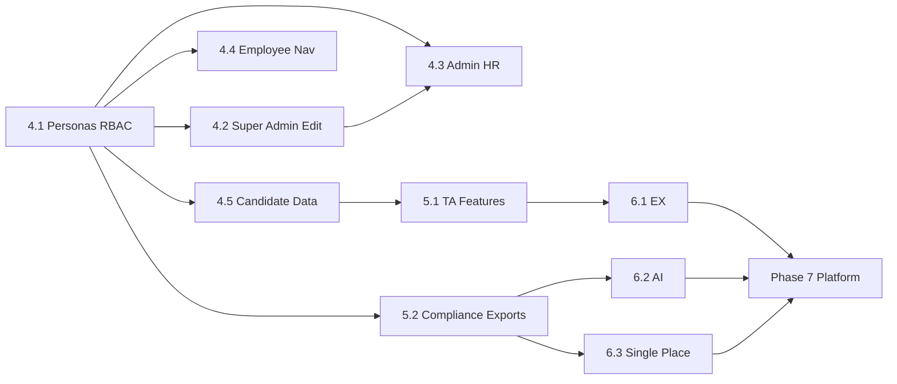

# Build Plan: Personas, Talent Acquisition, Compliance & USP

This plan assumes **Phases 1–3 (HRMS Full Transformation)** are done: ESS (Overview, Attendance, Leave), Team/People/Tasks/Performance, Exit/Alerts/Calendar/Knowledge Base, and RBAC for manager/admin.

---

## Phase 4: Personas, Super Admin, Admin HR, Candidate Data

**Goal:** Introduce Employee and Admin HR personas; Super Admin can edit everything; candidate profile captures CTC, company, skills.

### 4.1 Personas and RBAC (Schema + Auth)

| Task | Details |
|------|--------|
| **Schema** | Extend `Role` enum in [backend/prisma/schema.prisma](backend/prisma/schema.prisma): add `employee`, `admin_hr`. Keep `admin` as Super Admin. |
| **Migration** | New migration for enum changes. |
| **RBAC** | [backend/src/middleware/rbac.ts](backend/src/middleware/rbac.ts): Add `requireSuperAdmin`, `requireAdminHR`; include `employee` in `requireAnyAuth` where ESS is allowed. |
| **Auth** | Ensure register/signup (if any) does not allow self-service for `admin`/`admin_hr`; only Super Admin creates these. Update [backend/src/validators/authValidator.ts](backend/src/validators/authValidator.ts) to allow new roles. |
| **Seed** | Add users: `admin_hr@hireflow.com`, one `employee`; document roles in seed output. |

**Deliverables:** New roles in DB; middleware and seed updated; no UI yet.

---

### 4.2 Super Admin – Edit Everything (Users)

| Task | Details |
|------|--------|
| **API** | [backend/src/routes/userRoutes.ts](backend/src/routes/userRoutes.ts): `GET /api/users/:id` (full user + employee fields), `PUT /api/users/:id` (Super Admin only; all fields including `role`, `isActive`, `managerId`, etc.). Audit log on update. |
| **Frontend** | AdminPanel: label "Super Admin" for role admin, "Admin HR" for admin_hr, "Employee" for employee. Add "Edit" → User Edit page (full form: name, email, role, department, isActive, employeeId, manager, designation, location, joining date, birthday, organization, avatar, shift). Only Super Admin can change role and isActive. |
| **Layout** | [frontend/src/components/Layout.tsx](frontend/src/components/Layout.tsx): Show "Admin" nav for both `admin` and `admin_hr`. |

**Deliverables:** Super Admin can edit any user fully; Admin HR can edit user except role/deactivate (implement 4.3).

---

### 4.3 Admin HR Scope

| Task | Details |
|------|--------|
| **Backend** | User update route: if requester is `admin_hr`, reject if body contains `role` or `isActive` change. |
| **Frontend** | On User Edit, hide role dropdown and "Deactivate" when current user is Admin HR. Show "System Config" (Leave types, Shifts, Holidays) to Admin HR in Admin area. |
| **Leave/Attendance** | Admin HR can approve leave and regularization (same as admin/manager); ensure `requireManager` or equivalent includes `admin_hr`. |

**Deliverables:** Admin HR has full HR/TA access but cannot change roles or deactivate users.

---

### 4.4 Employee Persona – ESS Only

| Task | Details |
|------|--------|
| **Layout** | For role `employee`: hide Recruitment, Candidates, Policies, Draft Assistant, Audit, Admin. Show only Overview, My Team (if has reports), Leave, Attendance, Performance, Tasks, Exit, Alerts, Calendar, People (read), Knowledge Base. |

**Deliverables:** Employee sees only ESS and read-only People/KB.

---

### 4.5 Candidate – Richer Data

| Task | Details |
|------|--------|
| **Schema** | Candidate: add `currentCtc`, `expectedCtc` (Decimal/Float?), `presentCompany` (String?), `experienceYears` (Float?), `noticePeriodDays` (Int?), `technologies` (Json – array of strings). Migration. |
| **API** | [backend/src/routes/candidateRoutes.ts](backend/src/routes/candidateRoutes.ts): create/update/include new fields. [backend/src/validators/candidateValidator.ts](backend/src/validators/candidateValidator.ts): optional validation for new fields. |
| **Frontend** | [frontend/src/pages/CreateCandidate.tsx](frontend/src/pages/CreateCandidate.tsx): add Current CTC, Expected CTC, Present Company, Experience (years), Notice Period (days), Technologies (tags/multi-input). [frontend/src/pages/CandidateProfile.tsx](frontend/src/pages/CandidateProfile.tsx): display in Overview; add Edit (same fields) for recruiter/Admin HR/Super Admin. |

**Deliverables:** Candidate create/profile capture and display CTC, company, skills; edit from profile.

---

## Phase 5: Talent Acquisition Strengthening & Compliance Single-Click

**Goal:** Job requisitions (optional), pipeline stages, sourcing channel, TA dashboard; CSV exports and HR Data page.

### 5.1 Talent Acquisition – Core

| Task | Details |
|------|--------|
| **Schema** | Optional: `JobRequisition` (title, department, status, openedAt, closedAt, hiringManagerId). `Candidate.jobRequisitionId` (optional FK). `Candidate.source` (String? – referral, job_board, linkedin, agency). |
| **Stages** | Use or extend `Candidate.stage` with fixed set (e.g. Sourced, Screening, Interview, Offer, Hired); or add stage history table for audit. |
| **API** | `GET /api/candidates?stage=&source=&jobRequisitionId=&from=&to=`; `PATCH /api/candidates/:id` (include stage); `GET /api/ta/dashboard` (counts by stage, source, open reqs). |
| **Frontend** | Candidates list: filters (stage, source); optional kanban by stage. TA Dashboard page: pipeline funnel, source mix, open requisitions. |

**Deliverables:** TA filters, optional reqs, TA dashboard; candidate stage/source in profile.

---

### 5.2 Compliance & Single-Click Data

| Task | Details |
|------|--------|
| **Export APIs** | New route group (e.g. [backend/src/routes/reportRoutes.ts](backend/src/routes/reportRoutes.ts)): `GET /api/reports/employees?format=csv`, `GET /api/reports/candidates?format=csv&...`, `GET /api/reports/attendance?month=&year=&format=csv`, `GET /api/reports/leave?year=&format=csv`. Super Admin / Admin HR only. |
| **Audit** | Ensure user update, leave type/shift/holiday CRUD, candidate status/stage changes call `auditService.log()`. |
| **Frontend** | "HR Data" or "Compliance" page: tiles (Export Employees, Export Candidates, Export Attendance, Export Leave, Audit Log, Manage Leave Types, Shifts, Holidays). Each export as link/button that downloads CSV. |

**Deliverables:** One-click CSV exports; central HR Data page; audit coverage for sensitive changes.

---

## Phase 6: USP – Employee Experience & Single Place

**Goal:** Differentiators that add value: EX (pulse, recognition, announcements), AI (smart leave, resume parse, anomalies), Employee 360, Manager one-screen.

### 6.1 Employee Experience (EX)

| Task | Details |
|------|--------|
| **Pulse** | Model `PulseCheck` (userId, score 1–5, week, optional comment). API: `POST /api/pulse`, `GET /api/pulse/me?weeks=`. Frontend: optional weekly prompt on Overview; simple trend for manager (anonymous aggregate). |
| **Recognition** | Model `Recognition` (fromUserId, toUserId, type/badge, message, createdAt). API: create, list for user/team. Frontend: "Give thanks" on profile/team; show on Overview or profile. |
| **Announcements** | Model `Announcement` (title, body, createdById, effectiveFrom, effectiveTo). API: list (active). Frontend: Announcements section on Overview or dedicated page; optional "Mark as read" per user. |

**Deliverables:** Pulse check-in, peer recognition, company announcements.

---

### 6.2 AI & Automation (USP)

| Task | Details |
|------|--------|
| **Smart leave** | On leave apply or Overview: suggest "You have N days left; consider using before [date]" or "Team coverage low on [date]". Backend: optional endpoint or logic in leave service; frontend: banner or tip. |
| **Resume parse** | On add candidate: optional "Paste resume" or file upload → call AI (e.g. existing draft service or new parser) → prefill name, email, skills, experience, CTC hints. Frontend: paste area or upload in CreateCandidate. |
| **Anomaly alerts** | Scheduled or on-demand check: attendance pattern change, leave spike, long-open reqs. Create notifications or admin-only "Compliance alerts" widget. |

**Deliverables:** Smart leave suggestions; resume-to-profile prefill; basic anomaly notifications.

---

### 6.3 Single Place – 360 and Manager Screen

| Task | Details |
|------|--------|
| **Employee 360** | New page `/people/:id` (or `/employee/:id`): one view – profile, attendance summary, leave balance, tasks, 1:1s, recognitions, documents (if any). API: `GET /api/people/:id/360` aggregating from existing APIs. Access: self (own), manager (reports), Admin HR / Super Admin (all). |
| **Manager one-screen** | Dashboard for managers: team attendance summary, pending leave/regularization approvals, open tasks for team, hiring pipeline for their reqs. Reuse existing APIs; new page or Overview variant by role. |

**Deliverables:** Employee 360 page; Manager dashboard with approvals and team summary.

---

## Phase 7: Platform & Optional USPs

**Goal:** API, webhooks, SSO, document vault, compliance calendar – as capacity allows.

| Area | Tasks |
|------|--------|
| **Public API** | Read-only or scoped write endpoints (e.g. employees, leave requests) with API key auth; document for integrations. |
| **Webhooks** | Optional: on candidate stage change, leave approved, etc.; POST to customer URL. |
| **SSO** | SAML or OIDC integration for enterprise; config in Admin. |
| **Document vault** | Store offer letters, policy PDFs per user; version + date; optional acknowledgment. |
| **Compliance calendar** | List of due items (policy acknowledgment, training); link from HR Data page. |

**Deliverables:** As prioritized; can be split into Phase 7a/7b.

---

## Dependency Overview

---

## Implementation Order Summary

| Phase | Focus | Key deliverables |
|-------|--------|------------------|
| **4** | Personas, Super Admin, Admin HR, Candidate data | Roles + RBAC; full user edit (Super Admin); Admin HR scope; Employee nav; Candidate CTC/company/skills + UI |
| **5** | TA + Compliance | Job reqs/source/stages; TA dashboard; CSV reports; HR Data page; audit coverage |
| **6** | USP EX, AI, Single place | Pulse, Recognition, Announcements; smart leave, resume parse, anomalies; Employee 360; Manager one-screen |
| **7** | Platform | API, webhooks, SSO, document vault, compliance calendar (as scope allows) |

---

## Files to Create/Modify (Quick Reference)

**Backend:**  
`backend/prisma/schema.prisma` (Role, Candidate, optional JobRequisition, PulseCheck, Recognition, Announcement); migrations; `rbac.ts`, `userRoutes.ts`, `candidateRoutes.ts`, `candidateValidator.ts`; `reportRoutes.ts`; `pulseRoutes.ts`, `recognitionRoutes.ts`, `announcementRoutes.ts` (or under one); audit calls in user/config routes; seed.

**Frontend:**  
`Layout.tsx` (nav by role); `AdminPanel.tsx` + User Edit page; `CreateCandidate.tsx`, `CandidateProfile.tsx`; TA Dashboard; HR Data / Compliance page; Pulse + Recognition + Announcements UI; Employee 360 page; Manager dashboard; optional resume-upload/paste in CreateCandidate.

This build plan is the single reference for executing Personas, TA, Compliance, and USP features in order.
