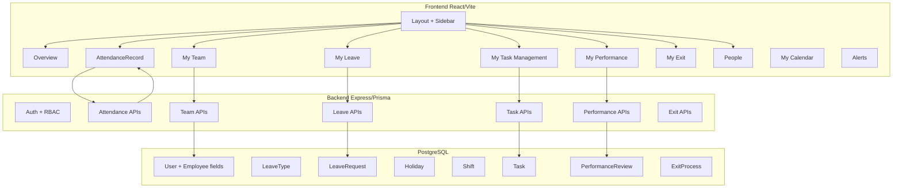

# HIREFLOW to Full HRMS Transformation Plan

## Current State vs Target

**Current HIREFLOW:**

- Recruitment-focused: Candidates, Interviews, Feedback, Approvals, Offers
- Basic User model: name, email, password, role, department
- Top nav: Dashboard, Candidates, Policies, Draft Assistant, Audit, Admin
- No employee profile (employeeId, manager, joining date, location, designation, birthday)

**Target HRMS (Qandle-inspired):**

- Employee Self-Service: Overview, My Leave, My Attendance
- People: My Team, People directory
- Workflows: My Performance, My Task Management, My Exit
- Supporting: Alerts, My Calendar, Knowledge Base (expand Policies)
- Compensation: **Deferred per user preference**

---

## Architecture Overview

---

## Schema Extensions (Prisma)

Extend [backend/prisma/schema.prisma](c:\Users\vivek.cursor\HRM\Hrm\backend\prisma\schema.prisma):

### User/Employee Extensions

- `employeeId` (String?, unique), `managerId` (self-ref), `designation`, `location`, `joiningDate`, `birthday`, `organization` (e.g. MakeMyLabs), `avatarUrl`
- Relation: `manager User?`, `directReports User[]`

### Phase 1 Models

- **AttendanceRecord:** userId, date, clockIn, clockOut, breakMinutes, totalMinutes, remark (Present/Week off/Auto Clocked Out/On Leave), regularizationRequested
- **AttendanceRegularization:** userId, attendanceRecordId, requestedClockIn/Out, reason, status (pending/approved/rejected), approverId
- **Shift:** name, inTime, outTime, breakMinutes (for shift details tab)
- **LeaveType:** name (Casual/Sick/Privilege/Bereavement/etc), unit (days), renewsYearly, accrualType
- **LeaveBalance:** userId, leaveTypeId, year, accrued, used, requested, balance
- **LeaveRequest:** userId, leaveTypeId, startDate, endDate, days, reason, status (pending/approved/rejected), approverId
- **Holiday:** name, date, isOptional

### Phase 2 Models

- **Task:** userId, title, dueDate, status (not_started/on_going/done), assignedById (self vs upline), createdAt
- **OneOnOne:** userId, managerId, scheduledAt, notes, status
- **PerformanceUpdate:** userId, content, createdAt
- **PerformanceReview:** userId, periodStart, periodEnd, status, ratings (JSON or structured)

### Phase 3 Models

- **ExitProcess:** userId, resignationDate, lastWorkingDate, status, initiatedAt
- **Notification:** userId, title, body, readAt, createdAt

### Existing Extensions

- **AuditLog:** Continue using for HRMS actions (leave requests, attendance changes, etc.)
- **Policies:** Extend to Knowledge Base (categories, documents, FAQs) – can use existing page with DB-backed content later

---

## Phase 1: ESS Core (Attendance, Leave, Overview)

### 1.1 Schema + Migrations

- Extend User with employee fields
- Add AttendanceRecord, AttendanceRegularization, Shift, LeaveType, LeaveBalance, LeaveRequest, Holiday

### 1.2 Backend APIs

- **Attendance:** `POST /api/attendance/clock-in`, `POST /api/attendance/clock-out`, `GET /api/attendance/me?month=&year=`, `POST /api/attendance/regularize`, `GET /api/attendance/shifts`
- **Leave:** `GET /api/leave/balances`, `GET /api/leave/requests`, `POST /api/leave/apply`, `GET /api/leave/holidays`, `GET /api/leave/types`
- **Overview:** `GET /api/dashboard/overview` – clock-in status, activity averages (last 7 days), request counts (leave/WFH/regularization), birthdays/anniversaries

### 1.3 Frontend

- **Layout:** Replace top nav with left sidebar + header (Qandle-style). Sidebar: Overview, My Team (placeholder), My Leave, My Attendance, My Performance (placeholder), My Task Management (placeholder), My Exit (placeholder), Alerts, My Calendar, People, Knowledge Base
- **Overview:** Clock-in button, current time, activity averages, Request Status (Leave/WFH/Regularization), Birthdays/Anniversaries, Calendar widget
- **My Attendance:** STATUS tab (month selector, summary cards, attendance log table, Regularize button), REGULARIZE REQUESTS tab, SHIFT DETAILS tab, POLICY DETAILS tab
- **My Leave:** STATUS tab (leave balances table, Apply Leave per type), REQUESTS tab, HOLIDAY LIST tab

### 1.4 Seed Updates

- Add employeeId, managerId, designation, location, joiningDate, birthday to demo users
- Seed Shift(s), LeaveTypes, Holidays, sample LeaveBalances, sample AttendanceRecords

---

## Phase 2: Team, Performance, Task Management

### 2.1 Backend APIs

- **Team:** `GET /api/team/me` (direct reports, hierarchy), `GET /api/team/overview` (team size, attendance %, avg hours), `GET /api/team/members` (list with filters: department, designation, status)
- **People:** `GET /api/people?search=&department=&location=` (employee directory)
- **Tasks:** `GET /api/tasks/me?week=&view=`, `POST /api/tasks`, `PATCH /api/tasks/:id`, `DELETE /api/tasks/:id`
- **Performance:** `GET /api/performance/1on1`, `POST /api/performance/1on1`, `GET /api/performance/updates`, `POST /api/performance/updates`, `GET /api/performance/reviews`

### 2.2 Frontend

- **My Team:** Relationship filters, team hierarchy visualization, tabs (Overview, Attendance, Leave, Performance, Tasks), KPI cards (team size, attendance %, avg hours), team member table with filters
- **People:** Search bar, filters (department, location), employee list/grid
- **My Task Management:** Weekly view / Status view, date navigation, ADD TASK per day, task status (Not Started, On Going, Done), Assigned by Upline vs Self Assigned
- **My Performance:** MY 1:1, UPDATES, REGULAR FEEDBACK, REVIEWS tabs; 1:1 scheduling, goal/competency placeholders

### 2.3 RBAC

- Managers: approve leave, view team attendance/leave, assign tasks to reports
- Employees: own attendance, leave, tasks, performance
- Admin: manage leave types, shifts, holidays; view all

---

## Phase 3: Exit, Alerts, Calendar, Knowledge Base

### 3.1 Backend APIs

- **Exit:** `GET /api/exit/me`, `POST /api/exit/initiate`, `PATCH /api/exit/:id` (HR workflow)
- **Alerts:** `GET /api/alerts/me`, `PATCH /api/alerts/:id/read`
- **Calendar:** `GET /api/calendar/events?month=&year=` – aggregate my leave, team leave, holidays, week-offs
- **Knowledge Base:** `GET /api/knowledge-base` (categories, docs) – can start as static/mock, later DB-backed

### 3.2 Frontend

- **My Exit:** Initiate resignation, view exit checklist, status
- **Alerts:** Notification list, mark as read
- **My Calendar:** Month view with event filters (My Leave, Team Leave, Holiday, Week Off), event markers
- **Knowledge Base:** Expand [frontend/src/pages/Policies.tsx](c:\Users\vivek.cursor\HRM\Hrm\frontend\src\pages\Policies.tsx) into KB with categories, search, documents

---

## UI/UX Direction

- **Layout:** Left sidebar (dark) with user profile card at top, icons + labels for nav items, active state highlighted
- **Header:** Logo left, global search (“Search by name, department or location”) center, notifications bell + user avatar right
- **Components:** Reusable KPI cards, data tables with filters, tabs, date pickers, forms aligned with Qandle screenshots
- **Styling:** Continue Tailwind; introduce accent color (e.g. purple/violet) for active states and CTAs to match reference

---

## Implementation Order Summary

| Phase | Modules                                             | Key Deliverables                                                                            |
| ----- | --------------------------------------------------- | ------------------------------------------------------------------------------------------- |
| **1** | Overview, My Attendance, My Leave                   | Schema + migrations, attendance/leave APIs, sidebar layout, Overview/Attendance/Leave pages |
| **2** | My Team, People, My Task Management, My Performance | Team/People/Task/Performance APIs and pages                                                 |
| **3** | My Exit, Alerts, My Calendar, Knowledge Base        | Exit workflow, notifications, calendar aggregation, KB expansion                            |

---

## Files to Create/Modify (Phase 1 Highlights)

**Backend:**

- [backend/prisma/schema.prisma](c:\Users\vivek.cursor\HRM\Hrm\backend\prisma\schema.prisma) – schema extensions
- `backend/src/routes/attendanceRoutes.ts`, `leaveRoutes.ts`, `overviewRoutes.ts`
- `backend/src/services/attendanceService.ts`, `leaveService.ts`
- `backend/src/routes/index.ts` – mount new routes
- `backend/prisma/seed.ts` – HRMS demo data

**Frontend:**

- [frontend/src/components/Layout.tsx](c:\Users\vivek.cursor\HRM\Hrm\frontend\src\components\Layout.tsx) – sidebar layout
- `frontend/src/pages/Overview.tsx`, `Attendance.tsx`, `Leave.tsx`
- [frontend/src/App.tsx](c:\Users\vivek.cursor\HRM\Hrm\frontend\src\App.tsx) – new routes

